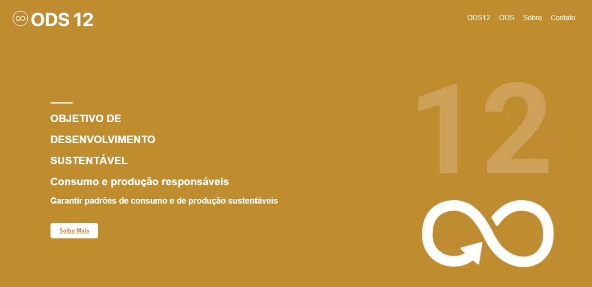
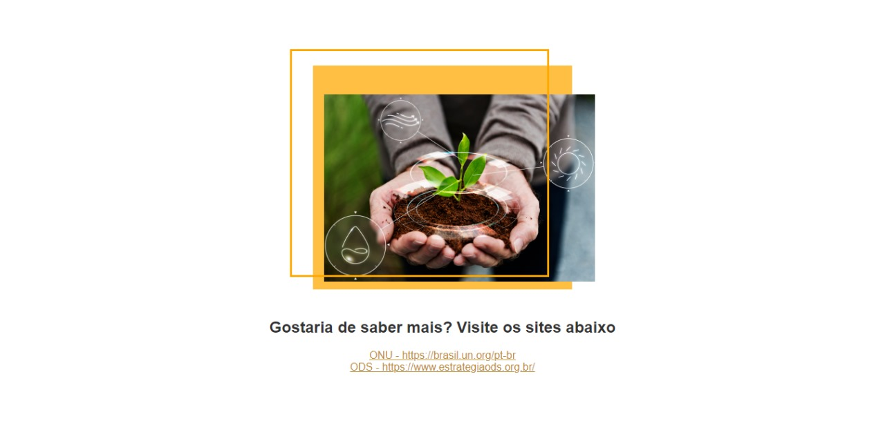
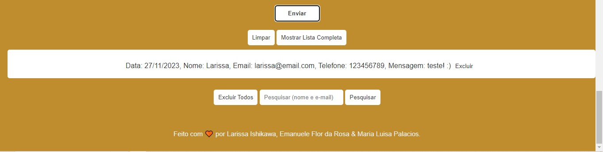

# WEBSITE ODS 12 - RELATÓRIO
#### Front-End - Projeto final 

##### Projeto criado baseado nos Objetivos de Desenvolvimento Sustentável (ODS) para o curso de Programação Front-End do segundo período.

Clique [aqui](https://larissaiishikawa.github.io/ods-12/) para acessar nosso GitHub Pages!
E clique [aqui](https://github.com/larissaiishikawa/ods-12) para acessar nosso GitHub Repository ;)

## Nome do grupo: ODS 12

## Objetivo do projeto
Divulgar o Objetivo de Desenvolvimento Sustentável 12, Consumo e produção sustentáveis, e impactar a sociedade ao adquirir conhecimentos sobre tal. É de extrema importância entender este objetivo para que possamos aquirir boas práticas e eventualmente construir um futuro melhor. 

## Descrição das funções JavaScript
### Incluir os dados do formulário em uma lista e no Local Storage
Esta função é responsável por coletar os dados inseridos pelo usuário no formulário, armazená-los em uma lista e, em seguida, salvar essa lista no Local Storage do navegador. Isso permite que os dados do formulário sejam persistidos mesmo após o usuário fechar ou recarregar a página.

### Excluir um item da lista e do Local Storage
Esta função permite ao usuário remover um item específico da lista de entradas do formulário. Quando um item é removido, a lista no Local Storage é atualizada para refletir essa alteração.

### Excluir todos os itens da lista e do Local Storage
Esta função permite ao usuário limpar todas as entradas do formulário de uma vez. Isso é útil se o usuário quiser começar do zero.

### Pesquisar um campo do formulário
Esta função permite ao usuário pesquisar um campo específico do formulário. Por exemplo, o usuário pode querer encontrar todas as entradas do formulário que contêm um determinado nome ou endereço de e-mail.

### Limpar os campos do formulário
Esta função limpa todos os campos do formulário, permitindo ao usuário inserir novos dados sem ter que apagar manualmente os dados antigos.

## Como ocorreu a divisão das tarefas entre os membros das equipes
- Emanuele: Desenvolvimento HTML (estrutura) e Javascript (funções)
- Larissa: Desenvolvimento HTML (revisão e ajustes), Formulário e Javascript (funções)
- Maria Luisa: Desenvolvimento CSS (estrutura e revisão) e Figma (idealização da ideia)

## Ferramentas e tecnologias
- HTML
- CSS
- Javascript
- Figma
- Git & Github

### Algum feedback?
Por favor, contate-nos! :D

**Redes sociais da Larissa**
- [E-mail](mailto:l.ishikawacunha@gmail.com)
- [Linkedin](https://www.linkedin.com/in/larissaishikawacunha/)
- [GitHub](https://github.com/larissaiishikawa)  

**Redes sociais da Emanuele**
- [E-mail](mailto:l.ishikawa@cunha)
- [Linkedin](https://www.linkedin.com/in/emanuele-flor-da-rosa-558762270/)
- [GitHub](https://github.com/emanueleflor) 

**Redes sociais da Maria Luisa**
- [E-mail](mailto:marialuisappalacios@gmail.com)
- [Linkedin](https://www.linkedin.com/in/maria-lu%C3%ADsa-pal%C3%A1cios-9858a2247/)
- [GitHub](https://github.com/MisaneDev) 
  

###### Feito com 🤍 por [LARISSA ISHIKAWA,](https://github.com/larissaiishikawa) [EMANUELE FLOR DA ROSA &](https://github.com/emanueleflor) [MARIA LUISA PALACIOS](https://github.com/MisaneDev)
